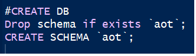
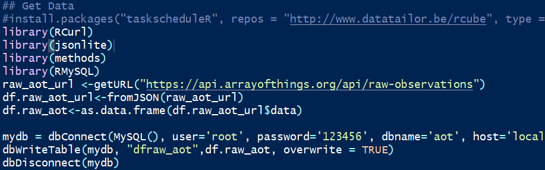
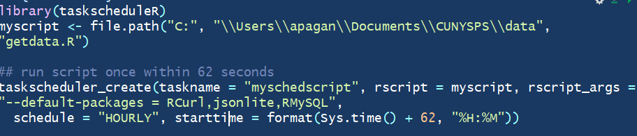

```{r setup, include=FALSE}
knitr::opts_chunk$set(echo = TRUE)
```

##Array Of Things {.tabset .tabset-fade .tabset-pills}

###Introduction

####Introduction
The Array of Things Projects is an urban Project that has been deployed to Chicago and will eventauly be expanded to several other Cities in the US. The goal is to place Nodes with Sensors to collect data. The sensors can track air quality, road conditions, traffic patterns as well as other data. The goal of the Array of Things Project is to enhance the quality of life of its population.
    
 - The data sources include:
        
    * Projects - City location 
    * Nodes - Devices that contain sensors
    * Sensors - Collects data for air quality, pressure, temperature , etc...
    * Observations - Manually collected data
    * Raw Observation - Data collected by sensors
    
 - Array of Thing Overview Documentation
    
    * https://arrayofthings.github.io/
    * https://arrayofthings.docs.apiary.io/#introduction/

 - Vendor Sensor and Datasheet - Waggle:

    * https://wa8.gl/
    * https://github.com/waggle-sensor/sensors/tree/master/sensors/datasheets

###Solution Structure

####Solution Structure
The project goal is to collect data from api and generate some plots with statistical data and map addresses with current sensor information. The velocity of data may be a bit of challenge. To address the constant change of data there is a need to store data on a continous bases. 

 - This solution consists of several files:
        
    1. CreateDB.SQL - Create the aot db to store the AOT data
    
    
        
    2. getdata.R - R file to get Raw data from API
    
    
        
    3. Schdeduledatapull.rmd - Rmd file uses taskscheduleR function to create a schedule task to run the getdata.r file to pull data from API and store it every hour.
    
    
    4. Arrayofthings.rmd - Rmd file pulls the remainder of the API data to merge with Raw data. It transforms the data and generates the plots and map

##Project In Action {.tabset .tabset-fade .tabset-pills}    

###Retrieve  and Transform Data

####Load Libraries

```{r message=FALSE, warning=FALSE}
library(dplyr)
library(tidyr)
library(jsonlite)
library(XML)
library(RCurl)
library(ggplot2)
library(plotly)
library(shiny)
library(ggmap)
library(sf)

```

####Retrieve Data
In this code we are loading the APIs for projects, nodes, sensors, observations and raw data. We then copy the data from Json and save to a list

```{r message=FALSE, warning=FALSE}

projects_aot_url <-getURL("https://api.arrayofthings.org/api/projects")
df.projects_aot_url<-fromJSON(projects_aot_url)
nodes_aot_url <-getURL("https://api.arrayofthings.org/api/nodes")
df.nodes_aot_url<-fromJSON(nodes_aot_url)
sensors_aot_url <-getURL("https://api.arrayofthings.org/api/sensors")
df.sensors_aot_url<-fromJSON(sensors_aot_url)
observations_aot_url<-getURL("https://api.arrayofthings.org/api/observations")
df.observations_aot_url<-fromJSON(observations_aot_url)
raw_aot_url <-getURL("https://api.arrayofthings.org/api/raw-observations")
df.raw_aot_url<-fromJSON(raw_aot_url)

```

####Covert List to dataframe
Here we are converting each dataset list into dataframes. We use the names funciton to display the columns of each dataset.

```{r message=FALSE, warning=FALSE, paged.print=FALSE}
df.projects_aot<-as.data.frame(df.projects_aot_url$data)
df.nodes_aot<-as.data.frame(df.nodes_aot_url$data)
df.sensors_aot<-as.data.frame(df.sensors_aot_url$data)
df.observations_aot<-as.data.frame(df.observations_aot_url$data)
df.raw_aot<-as.data.frame(df.raw_aot_url$data)
names(df.projects_aot)
names(df.nodes_aot)
names(df.sensors_aot)
names(df.observations_aot)
names(df.raw_aot)
```

####Transform Data
In the transformation phase we need to separate the location column into latitude and longtitude then rename the 2 new columns to Long and Lat so we can  merge with map data later. We then merge new dataframe with raw data joined by vsn field.

```{r message=FALSE, warning=FALSE}
df.nodes_aot <- cbind(df.nodes_aot, data.frame(matrix(unlist(df.nodes_aot$location[,3]), nrow=nrow(df.nodes_aot), byrow=T),stringsAsFactors=FALSE))

names(df.nodes_aot)[7]<-"long"
names(df.nodes_aot)[8]<-"lat"

names(df.raw_aot)[4]<-"vsn"
df.merge_aot<-merge(df.nodes_aot, df.raw_aot, by = "vsn")
```

####Retrieve Hourly Data
In this step we get the latest data. We connect to the MSQL DB that has been inserting hourly raw data with the scheduled getdata.r file.

```{r message=FALSE, warning=FALSE}
library(RMySQL)
mydb = dbConnect(MySQL(), user='root', password='123456', dbname= 'aot', host='localhost')
dfstats_aot<-dbGetQuery(mydb, "SELECT count(sensor_path) as num_of_samples,sensor_path, format(avg(hrf),2) as avg_sample,  
FORMAT(STD(hrf),2)  as std_sample, format(avg(hrf)+ 1*std(hrf),2) as 1Std, format(avg(hrf)+ 2*std(hrf),2) as 2Std,
format(avg(hrf)+ 3*std(hrf),2) as 3Std FROM aot.dfraw_aot
where hrf is not null
group by sensor_path")
dbDisconnect(mydb)
```

####Merge Data - Stat data
Here we merge the transform data with the data retrieved from the MYSql db by the sensor_path column. In addition, we add an additionl calculated column to the merged data for later display in the map.

```{r message=FALSE, warning=FALSE}
df.merge_aot_all<-merge(dfstats_aot, df.merge_aot,  by = "sensor_path")

#Add Std calcuation
df.merge_aot_all$std_aot<-as.integer(df.merge_aot_all$hrf) - as.integer(df.merge_aot_all$avg_sample)/as.integer(df.merge_aot_all$std_sample)
```

###Display Readings - Plolty 

####Display Readings - Plolty 
This step displays plotly box plots of the merged data. One plotly plot is displayed by sensor_path and the other is displayed by address.

```{r message=FALSE, warning=FALSE}
#Plotly Histogram
#plot_ly(df.merge_aot_all, x = ~hrf, y = ~sensor_path)

#Plotly by Sensor Path
plot_ly(df.merge_aot_all, x = ~hrf, color = ~sensor_path, 
type = "box",width = 950, height = 1100)%>%
layout(margin = list(l = 200))

#Plotly by Address
plot_ly(df.merge_aot_all, x = ~hrf, color = ~address, 
type = "box",width = 950, height = 1100)%>%
layout(margin = list(l = 200))
 
```

###Display Data on Map

####Display Data on Map
This last step generates a map with the latest stats and raw data by node address. It uses the leaflet map function and places details in content into the popup.

```{r message=FALSE, warning=FALSE}
#install.packages("leaflet")
library(leaflet)

#Set Details of data
content <- paste(sep = "<br/>",
 "------------------------------",
 df.merge_aot_all$description,
 df.merge_aot_all$address,
 "------------------------------",
 '<b>Lastest Reading in GMT:</>', 
 df.merge_aot_all$timestamp,
 df.merge_aot_all$sensor_path,
 df.merge_aot_all$hrf,
  "------------------------------",
 '<b>Sample Count, Standard Deviation, Average</>',
 df.merge_aot_all$num_of_samples,
 df.merge_aot_all$std_sample,
 df.merge_aot_all$avg_sample)


df = data.frame(Lat = df.merge_aot_all$lat, Long = df.merge_aot_all$long)

   
m <- leaflet(df, width = 900, height = 600) %>% 
    setView(lng = df.merge_aot_all$long[nrow(df.merge_aot_all)], lat = df.merge_aot_all$lat[nrow(df.merge_aot_all)], zoom = 10)
m %>% 
    addTiles() %>% 
    #addCircles()%>%
    addMarkers(df.merge_aot_all$long, df.merge_aot_all$lat, popup = paste(sep = "<br/>", content))
    
       
```


##Conclusion {.tabset .tabset-fade .tabset-pills}

###Conclusion
This project took updated API data from serveral sources, collected and transformed the data, merged and displayed the data in statistical boxplots and took goelocation to map location of devices. The map displayed current reading and basic statistical data with the historical hourly collections.
