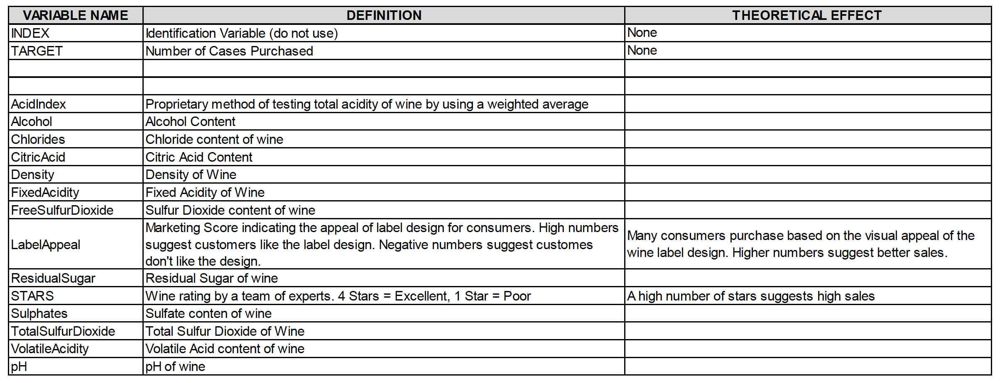

```{r message=FALSE, warning=FALSE, include=FALSE}
knitr::opts_chunk$set(echo = FALSE, warning = FALSE)
require(knitr)
library(MASS)
library(psych)
library(kableExtra)
library(tidyverse)
library(faraway)
library(gridExtra)
library(reshape2)
library(leaps)
library(caret)
library(naniar)
library(pander)
library(pROC)
library(corrplot)
library(jtools)
```

```{r echo=FALSE, message=FALSE, warning=FALSE} 
WineTrain <- read.csv("https://raw.githubusercontent.com/pkowalchuk/CUNY621-HW5/master/wine-training-data.csv",na.strings="",header=TRUE)
WineTrain1 <- WineTrain
WineEval <- read.csv("wine-evaluation-data.csv",na.strings="",header=TRUE)
```

## OVERVIEW

In this homework assignment, we will explore, analyze and model a data set containing information on approximately 12,000 commercially available wines. The variables are mostly related to the chemical properties of the wine being sold. The response variable is the number of sample cases of wine that were purchased by wine distribution companies after sampling a wine. These cases would be used to provide tasting samples to restaurants and wine stores around the United States. The more sample cases purchased, the more likely is a wine to be sold at a high end restaurant. A large wine manufacturer is studying the data in order to predict the number of wine cases ordered based upon the wine characteristics. If the wine manufacturer can predict the number of cases, then that manufacturer will be able to adjust their wine offering to maximize sales.

## Objective: 

Our objective is to build a count regression model to predict the number of cases of wine that will be sold given certain properties of the wine. HINT: Sometimes, the fact that a variable is missing is actually predictive of the target. You can only use the variables given to you (or variables that you derive from the variables provided). 

Below is a short description of the variables of interest in the data set:



```{r echo=FALSE, message=FALSE, warning=FALSE} 
kable(textbook<-data.frame(VARIABLE.NAME=c("INDEX","TARGET","","","AcidIndex","Alcohol","Chlorides","CitricAcid","Density"," FixedAcidity","FreeSulfurDioxide","LabelAppeal","ResidualSugar","STARS","Sulphates","TotalSulfurDioxide","VolatileAcidity","pH"),DEFINITION=c("Identification Variable (do not use)","Number of Cases Purchased","","","Proprietary method of testing total acidity of wine by using a weighted average,","Alcohol Content","Chloride content of wine","Citric Acid Content","Density of Wine ","Fixed Acidity of Wine","Sulfur Dioxide content of wine","Marketing Score indicating the appeal of label design for consumers. High numbers suggest customers like the label design. Negative numbers suggest customers don't like the design","Residual Sugar of wine","Wine rating by a team of experts. 4 Stars = Excellent, 1 Star = Poor","Sulfate content of wine","Total Sulfur Dioxide of Wine","Volatile Acid content of wine","pH of wine"),THEORETICAL.EFFECT=c("None","None","","","","","","","","","","Many consumers purchase based on the visual appeal of the wine label design. Higher numbers suggest better sales.","","A high number of stars suggests high sales","","","","")))
```

# DATA EXPLORATION

## Data Summary 
With over 12,000 observations in our sample, we must look into the data and explore key summary statistics. We also calculate the counts for NA's, 0, negative, and unique values. 
```{r echo=FALSE, message=FALSE, warning=FALSE, paged.print=FALSE}
#glimpse(WineTrain)
#colnames(WineTrain[-1])<-"INDEX"
summary(WineTrain)

var_stats<- function(WineTrain){
  wt <- WineTrain[-1]
  wine1 <- describe(wt)
  #wine1$na_count <- sapply(WineTrain[-1], function(y) sum(length(which(is.na(y)))))
  wine1$na_count <- sapply(wt, function(y) sum(is.na(y)))
  wine1$neg_count <- sapply(wt, function(y) sum(y<0))
  wine1$zero_count <- sapply(wt, function(y) sum(as.integer(y)==0))
  wine1$unique_count <- sapply(wt, function(y) sum(n_distinct(y)))
  
  return(wine1)
}
wine1 <- var_stats(WineTrain)

kable(wine1, "html", escape = F) %>%
  kable_styling("striped", full_width = T) %>%
  column_spec(1, bold = T) %>%
  scroll_box(width = "100%", height = "700px")

#  geom_point(data = wine1, color = "red", shape = 15, size = 5)
```

We visualize these counts per variable and then explore solutions further below. 
```{r}

qplot(wine1[c(-1),]$unique_count, 
      geom="bar",  
      fill=as_factor(rownames(wine1[c(-1),])))

```


```{r echo=FALSE, message=FALSE, warning=FALSE, paged.print=FALSE}
colsTrain<-ncol(WineTrain)
colsEval<-ncol(WineEval)
missingCol<-colnames(WineTrain)[!(colnames(WineTrain) %in% colnames(WineEval))]
```

The dataset consists of two data files: training and evaluation. The training dataset contains `r colsTrain` columns, and the evaluation dataset also contains `r colsEval` columns. 

## Missing Data

An important aspect of any dataset is to determine how much, if any, data is missing. We look at all the variables to see which if any have missing data. We look at the basic descriptive statistics as well as the missing data and percentages. 

We start by looking at the dataset as a whole and determine how many complete rows, that is rows with data for all predictors we have.

```{r echo=FALSE, message=FALSE, warning=FALSE}
cc<-summary(complete.cases(WineTrain))
cWineTrain<-subset(WineTrain, complete.cases(WineTrain))
cc
vis_miss(WineTrain)
gg_miss_upset(WineTrain)
```

With these results, if we remove all rows with incomplete rows, there will be a total of `r as.integer(cc[3])` rows out of `r nrow(WineTrain)` .If we eliminate all non-complete rows and keep only rows with data for all the predictors in the dataset, our new dataset will results in `r round(as.integer(cc[3])/nrow(WineTrain),2)*100`% of the total dataset. We create a subset of data with complete cases if needed later in our analysis.


```{r}
glimpse(cWineTrain)
WineTrain1$INDEX <- NULL
```

## Visualization
We consider each variable

### Target Variable 
The distribution of our target variable is normal with the exception of many 0 Wine count entries. At such a high percentage, the zero scores likely reflect lack of popularity rather than error, especially if they get low human ratings.

####  Histogram
```{r echo=FALSE, message=FALSE, warning=FALSE, paged.print=FALSE}
hist(WineTrain1$TARGET, col = "blue", xlab = " Target ", main = "Wine Counts")
```
 
#### Integers
The integer variables have a small range and look normal, similar to TARGET. Stars has the least number of values and has many 0 entries. We will treat these as meaningful due to the percentage of NA's. Decision makers who buy wine are similar to the population who creates the integer variables and the range of values is small, so we choose not to impute these. 
```{r echo=FALSE, message=FALSE, warning=FALSE, paged.print=FALSE}
WineTrain1[-1] %>%
  keep(is.integer) %>% 
  gather() %>% 
  ggplot(aes(value), main="") +
  facet_wrap(~ key, scales = "free") +
  geom_histogram()
```


#### Doubles
The Double variable types look very similar to one another, and look somewhat normal. These look okay to impute after we've run our diagnostic plots.
```{r echo=FALSE, message=FALSE, warning=FALSE, paged.print=FALSE}
WineTrain1 %>%
  keep(is.double) %>% 
  gather() %>% 
  ggplot(aes(value)) +
  facet_wrap(~ key, scales = "free") +
  geom_histogram()
```

### Outliers
####  Boxplot
```{r echo=FALSE, message=FALSE, warning=FALSE, paged.print=FALSE}
ggplot(melt(WineTrain[-1]), aes(x=factor(variable), y=value, fill=factor(variable))) + facet_wrap(~variable, scale="free") + geom_boxplot()
```
#### Boxplot Without outliers

```{r echo=FALSE, message=FALSE, warning=FALSE, paged.print=FALSE}
ggplot(melt(WineTrain[-1]), aes(x=factor(variable), y=value, fill=factor(variable))) + facet_wrap(~variable, scale="free") + geom_boxplot(outlier.shape=NA)
```

#### Correlation
We note that the human ratings all have high correlations than do our chemical features. 
```{r echo=FALSE, message=FALSE, warning=FALSE, paged.print=FALSE}
corrplot(as.matrix(cor(WineTrain[-1], use = "pairwise.complete")),method = "shade")
```

# DATA PREPERATION

```{r echo=FALSE, message=FALSE, warning=FALSE, paged.print=FALSE}
print(wine1[,14:17])
```
We recall that STARS has a high correlation with TARGET and we see that it has r`(wine1["STARS","na_count"]/nrow(WineTrain))*100`% NA's and no zero's. We change NA to 0.

```{r echo=FALSE, message=FALSE, warning=FALSE, paged.print=FALSE}
print(wine1[order(-wine1$na_count),14:17]) 
#WineTrain$STARS <- sapply(WineTrain$STARS,function(x) ifelse(is.na(x),0,x))
#WineTrain<-as.factor(WineTrain)
#wine1 <- var_stats(WineTrain)
```

The remaining NA counts include continuous variables which we will impute.
```{r echo=FALSE, message=FALSE, warning=FALSE, paged.print=FALSE}
#mice imputation
#print(wine1[order(-wine1$na_count),14:17])
```

We can normalize the negative counts, through BoxCox, since one of them has some correlation and is based on human ratings. While the negative ratings make the data irregular to work with, it is unlikely that so many people (r`(wine1["STARS","neg_count"]/nrow(WineTrain))*100`% )did not mean to give a negative rating. We can do this to the continuous variables as well rather than delete them, since they also have high counts. 

```{r echo=FALSE, message=FALSE, warning=FALSE, paged.print=FALSE}
print(wine1[order(-wine1$neg_count),14:17]) 
         
         
         
```

By the same logic we will leave the zero counts alone until normalization. We can exclude the TARGET variable unless we will be normalizing it specifically for our later work. 

```{r echo=FALSE, message=FALSE, warning=FALSE, paged.print=FALSE}
print(wine1[order(-wine1$zero_count),14:17])
```

We want to take a look at the least unique counts next, and by a large margin LabelAppeal, STARS, and AcidIndex show low unique counts. We can exclude TARGET until we analyze our feature transformation decisions. We see that AcidIndex is a proprietary weighted method for measuring Acid. We do not need to impute this, given its complexity and relative influence, and the risk or changing our results our very small ranges. 
```{r echo=FALSE, message=FALSE, warning=FALSE, paged.print=FALSE}
print(wine1[order(wine1$unique_count),14:17]) 
         
```

```{r echo=FALSE, message=FALSE, warning=FALSE, paged.print=FALSE} 
WineTrain$STARS<-as.factor(WineTrain$STARS)
WineEval$STARS<-as.factor(WineEval$STARS)
#WineTest 
```
## TODO: Diagnostic

# BUILD MODEL

## Model 1: Poisson Regression (all predictors)

For the first model, we used the Poisson regression and all of the predictors.

```{r echo=FALSE, message=FALSE, warning=FALSE, paged.print=FALSE}
m1 <- glm(TARGET ~ ., family = poisson, data = WineTrain)
#m1 <- glm(TARGET ~ ., family = poisson, data = WineTrain)
summary(m1)
par(mfrow = c(2,2))
plot(m1)
```

## Model 2: Poisson Regression (reduced predictors)

For the second model, based on model 1, we reduced the number of predictors. 

```{r echo=FALSE, message=FALSE, warning=FALSE, paged.print=FALSE}
m2 <- glm(TARGET ~ VolatileAcidity + CitricAcid + Chlorides + FreeSulfurDioxide
                        + TotalSulfurDioxide + Density + pH + Sulphates + Alcohol + LabelAppeal
             + AcidIndex + STARS, family = poisson, data = WineTrain)
summary(m2)
par(mfrow = c(2,2))
plot(m2)
```

```{r echo=FALSE, message=FALSE, warning=FALSE, paged.print=FALSE}
plot_summs(m2, scale = TRUE, exp = TRUE)
```

## Model 3: Gaussian Regression (significant predictors)

```{r echo=FALSE, message=FALSE, warning=FALSE, paged.print=FALSE}
m3 <- glm(TARGET ~ VolatileAcidity + FreeSulfurDioxide + TotalSulfurDioxide + Chlorides + Density + pH + Sulphates + LabelAppeal + AcidIndex + STARS, family=gaussian, data = WineTrain)
summary(m3)
par(mfrow = c(2,2))
plot(m3)
```  

Model 3 shows a better Q-Q plot than the previous two models.

## Model 4: Negative Binomial Regression

```{r echo=FALSE, message=FALSE, warning=FALSE, paged.print=FALSE}
m4 <- glm(TARGET ~ VolatileAcidity + TotalSulfurDioxide + 
     pH + Sulphates + LabelAppeal + AcidIndex + STARS, family = negative.binomial(1), 
     data = WineTrain)
summary(m4)
par(mfrow = c(2,2))
plot(m4)
```

# SELECT MODEL
## Pick the best regression model

```{r echo=FALSE,message=FALSE,warning=FALSE}
m1AIC <- AIC(m1)
m1BIC <- BIC(m1)
m2AIC <- AIC(m2)
m2BIC <- BIC(m2)
m3AIC <- AIC(m3)
m3BIC <- BIC(m3)
m4AIC <- AIC(m4)
m4BIC <- BIC(m4)

AIC <- list(m1AIC, m2AIC, m3AIC, m4AIC)
BIC <- list(m1BIC, m2BIC, m3BIC, m4BIC)
kable(rbind(AIC, BIC), col.names = c("Model 1", "Model 2", "Model 3", "Model 4"))  %>% 
  kable_styling(full_width = T)

```

With 4 models computed, we select the model with the lowest combination of AIC and BIC. From the table, we can see the model to pick is model 3

#CONCLUSION

```{r echo=FALSE, message=FALSE}
eval_p<-predict(m3,WineEval, type = "response")
write.csv(eval_p,"predicted_eval_values.csv")
```

Model 3 showed the best result. We can observe its performance by plotting the datasets TARGET values agaisnt the predicted values. One thing we observe is that the model doesn't predict a TARGET of 8.

```{r echo=FALSE, message=FALSE}
train_p<-predict(m3,WineTrain, type = "response")
plot(train_p,WineTrain$TARGET)
```

Other models, although of worse performace according to our selection metric, do show results of TARGET 8, but as can be seen in the graph below, they do not corresponde to real TARGET 8 classifications.

```{r echo=FALSE, message=FALSE}
train_p<-predict(m2,WineTrain, type = "response")
plot(train_p,WineTrain$TARGET)
```


# APPENDIX

**Code used in analysis**

**Libraries used**

require(knitr)
library(MASS)
library(psych)
library(kableExtra)
library(tidyverse)
library(faraway)
library(gridExtra)
library(reshape2)
library(leaps)
library(caret)
library(naniar)
library(pander)
library(pROC)
library(corrplot)
library(jtools)

**Loading data**

WineTrain <- read.csv("https://raw.githubusercontent.com/pkowalchuk/CUNY621-HW5/master/wine-training-data.csv",na.strings="",header=TRUE)
WineTrain1 <- WineTrain
WineEval <- read.csv("wine-evaluation-data.csv",na.strings="",header=TRUE)

**Data Exploration**

summary(WineTrain)

var_stats<- function(WineTrain){
  wt <- WineTrain[-1]
  wine1 <- describe(wt)
  #wine1$na_count <- sapply(WineTrain[-1], function(y) sum(length(which(is.na(y)))))
  wine1$na_count <- sapply(wt, function(y) sum(is.na(y)))
  wine1$neg_count <- sapply(wt, function(y) sum(y<0))
  wine1$zero_count <- sapply(wt, function(y) sum(as.integer(y)==0))
  wine1$unique_count <- sapply(wt, function(y) sum(n_distinct(y)))
  
  return(wine1)
}
wine1 <- var_stats(WineTrain)

kable(wine1, "html", escape = F) %>%
  kable_styling("striped", full_width = T) %>%
  column_spec(1, bold = T) %>%
  scroll_box(width = "100%", height = "700px")


qplot(wine1[c(-1),]$unique_count, 
      geom="bar",  
      fill=as_factor(rownames(wine1[c(-1),])))

colsTrain<-ncol(WineTrain)
colsEval<-ncol(WineEval)
missingCol<-colnames(WineTrain)[!(colnames(WineTrain) %in% colnames(WineEval))]

**Missing Data**

cc<-summary(complete.cases(WineTrain))
cWineTrain<-subset(WineTrain, complete.cases(WineTrain))
cc
vis_miss(WineTrain)
gg_miss_upset(WineTrain)

**Modeling**

m1 <- glm(TARGET ~ .-INDEX , family = poisson, data = WineTrain)
summary(m1)
par(mfrow = c(2,2))
plot(m1)

m2 <- glm(TARGET ~ VolatileAcidity + CitricAcid + Chlorides + FreeSulfurDioxide
                        + TotalSulfurDioxide + Density + pH + Sulphates + Alcohol + LabelAppeal
             + AcidIndex + STARS, family = poisson, data = WineTrain)
summary(m2)
par(mfrow = c(2,2))
plot(m2)

m3 <- glm(TARGET ~ VolatileAcidity + FreeSulfurDioxide + TotalSulfurDioxide + Chlorides + Density + pH + Sulphates + LabelAppeal + AcidIndex + STARS, family=gaussian, data = WineTrain)
summary(m3)
par(mfrow = c(2,2))
plot(m3)

m4 <- glm(TARGET ~ VolatileAcidity + TotalSulfurDioxide + 
     pH + Sulphates + LabelAppeal + AcidIndex + STARS, family = negative.binomial(1), 
     data = WineTrain)
summary(m4)
par(mfrow = c(2,2))
plot(m4)
