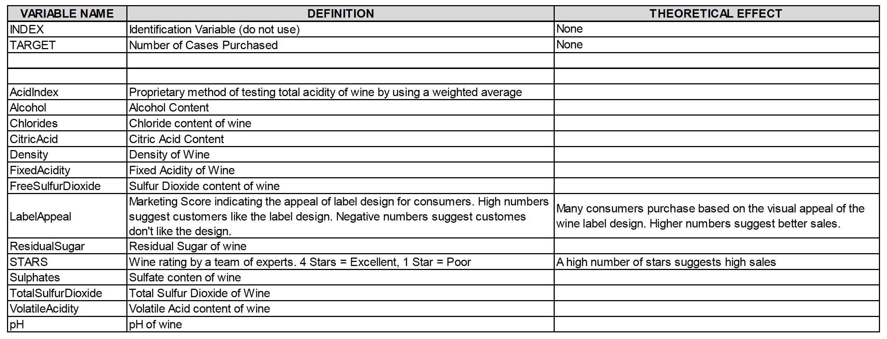

```{r message=FALSE, warning=FALSE, include=FALSE}
knitr::opts_chunk$set(echo = FALSE, warning = FALSE)
require(knitr)
library(ggplot2)
library(tidyr)
library(MASS)
library(psych)
library(kableExtra)
library(dplyr)
library(faraway)
library(gridExtra)
library(reshape2)
library(leaps)
library(caret)
library(naniar)
library(pander)
library(pROC)
library(corrplot)

```

```{r echo=FALSE, message=FALSE, warning=FALSE}
#WineTrain <- read.csv("wine-training-data.csv",na.strings="",header=TRUE)
WineTrain <- read.csv("https://raw.githubusercontent.com/pkowalchuk/CUNY621-HW5/master/wine-training-data.csv", na.strings="",header=TRUE)
WineTrain1 <- WineTrain
WineEval <- read.csv("wine-evaluation-data.csv",na.strings="",header=TRUE)
```

## OVERVIEW

In this homework assignment, we will explore, analyze and model a data set containing information on approximately 12,000 commercially available wines. The variables are mostly related to the chemical properties of the wine being sold. The response variable is the number of sample cases of wine that were purchased by wine distribution companies after sampling a wine. These cases would be used to provide tasting samples to restaurants and wine stores around the United States. The more sample cases purchased, the more likely is a wine to be sold at a high end restaurant. A large wine manufacturer is studying the data in order to predict the number of wine cases ordered based upon the wine characteristics. If the wine manufacturer can predict the number of cases, then that manufacturer will be able to adjust their wine offering to maximize sales.

## Objective: 

Our objective is to build a count regression model to predict the number of cases of wine that will be sold given certain properties of the wine. HINT: Sometimes, the fact that a variable is missing is actually predictive of the target. You can only use the variables given to you (or variables that you derive from the variables provided). Below is a short description of the variables of interest in the data set:




# DATA EXPLORATION

## Data Summary 
```{r echo=FALSE, message=FALSE, warning=FALSE, paged.print=FALSE}
summary(WineTrain)

wine1 <- describe(WineTrain[-1])
wine1$na_count <- sapply(WineTrain[-1], function(y) sum(length(which(is.na(y)))))

kable(wine1, "html", escape = F) %>%
  kable_styling("striped", full_width = T) %>%
  column_spec(1, bold = T) %>%
  scroll_box(width = "100%", height = "700px")

```

```{r echo=FALSE, message=FALSE, warning=FALSE, paged.print=FALSE}
colsTrain<-ncol(WineTrain)
colsEval<-ncol(WineEval)
missingCol<-colnames(WineTrain)[!(colnames(WineTrain) %in% colnames(WineEval))]
```

The dataset consists of two data files: training and evaluation. The training dataset contains `r colsTrain` columns, and the evaluation dataset also contains `r colsEval` columns. 

## Missing Data

An important aspect of any dataset is to determine how much, if any, data is missing. We look at all the variables to see which if any have missing data. We look at the basic descriptive statistics as well as the missing data and percentages. 

We start by looking at the dataset as a whole and determine how many complete rows, that is rows with data for all predictors we have.

```{r echo=FALSE, message=FALSE, warning=FALSE}
cc<-summary(complete.cases(WineTrain))
cWineTrain<-subset(WineTrain, complete.cases(WineTrain))
cc
gg_miss_upset(WineTrain)
vis_miss(WineTrain)
```

With these results, if we remove all rows with incomplete rows, there will be a total of `r as.integer(cc[3])` rows out of `r nrow(WineTrain)` .If we eliminate all non-complete rows and keep only rows with data for all the predictors in the dataset, our new dataset will results in `r round(as.integer(cc[3])/nrow(WineTrain),2)*100`% of the total dataset. We create a subset of data with complete cases only to use later in our analysis.


```{r}
glimpse(cWineTrain)
WineTrain1$INDEX <- NULL
```

## Visualization

####  Histogram
```{r }
hist(WineTrain1$TARGET, col = "blue", xlab = " Target ", main = "Wine Counts")
```

####  Boxplot
```{r}
ggplot(melt(WineTrain[-1]), aes(x=factor(variable), y=value)) + facet_wrap(~variable, scale="free") + geom_boxplot()
```

#### Correlation
```{r}
corrplot(as.matrix(cor(WineTrain, use = "pairwise.complete")),method = "shade")
```


    
# BUILD MODEL

## Model 1: Poisson Regression (all predictors)

For the first model, we used the poisson regression and all of the predictors.

```{r}
m1 <- glm(TARGET ~ .-ï..INDEX , family = poisson, data = WineTrain)
summary(m1)
par(mfrow = c(2,2))
plot(m1)
```

## Model 2: Poisson Regression (reduced predictors)

For the second model, based on model 1, we reduced the number of predictors. 

```{r}
m2 <- glm(TARGET ~ VolatileAcidity + CitricAcid + Chlorides + FreeSulfurDioxide
                        + TotalSulfurDioxide + Density + pH + Sulphates + Alcohol + LabelAppeal
             + AcidIndex + STARS, family = poisson, data = WineTrain)
summary(m2)
par(mfrow = c(2,2))
plot(m2)
```

## Model 3: Gaussian Regression (significant predictors)

```{r}
m3 <- glm(TARGET ~ VolatileAcidity + FreeSulfurDioxide + TotalSulfurDioxide + Chlorides + Density + pH + Sulphates + LabelAppeal + AcidIndex + STARS, family=gaussian, data = WineTrain)
summary(m3)
par(mfrow = c(2,2))
plot(m3)
```  

Model 3 shows a better Q-Q plot than the previous two models.

## Model 4: Negative Binomial Regression

```{r}
m4 <- glm(TARGET ~ VolatileAcidity + TotalSulfurDioxide + 
     pH + Sulphates + LabelAppeal + AcidIndex + STARS, family = negative.binomial(1), 
     data = WineTrain)
summary(m4)
par(mfrow = c(2,2))
plot(m4)
```


# SELECT MODEL
## Pick the best regression model

```{r echo=FALSE,message=FALSE,warning=FALSE}
m1AIC <- AIC(m1)
m1BIC <- BIC(m1)
m2AIC <- AIC(m2)
m2BIC <- BIC(m2)
m3AIC <- AIC(m3)
m3BIC <- BIC(m3)
m4AIC <- AIC(m4)
m4BIC <- BIC(m4)

AIC <- list(m1AIC, m2AIC, m3AIC, m4AIC)
BIC <- list(m1BIC, m2BIC, m3BIC, m4BIC)
kable(rbind(AIC, BIC), col.names = c("Model 1", "Model 2", "Model 3", "Model 4"))  %>% 
  kable_styling(full_width = T)

```

With 4 models computed, we select the model with the lowest combination of AIC and BIC. From the table, we can see the model to pick is model 3

#CONCLUSION

```{r echo = FALSE, message=FALSE}
eval_p<-predict(m3,WineEval, type = "response")
write.csv(eval_p,"predicted_eval_values.csv")
```


# APPENDIX

**Code used in analysis**
```{r, ref.label=knitr::all_labels(),echo=TRUE,eval=FALSE}

```
