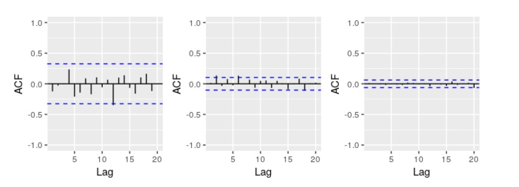

```{r setup, include=FALSE}
knitr::opts_chunk$set(
	echo = FALSE,
	message = FALSE,
	warning = FALSE
)
#knitr::opts_chunk$set(echo = TRUE)
require(knitr)
library(ggplot2)
library(tidyr)
library(MASS)
library(psych)
library(kableExtra)
library(dplyr)
library(faraway)
library(gridExtra)
library(reshape2)
library(leaps)
library(pROC)
library(caret)
library(naniar)
library(pander)
library(pROC)
library(mlbench)
library(e1071)
library(fpp2)
library(urca)
```


Figure 8.31 shows the ACFs for 36 random numbers, 360 random numbers and 1,000 random numbers. 



## 1) ACF

### (a) Explain Differences
Explain the differences among these figures. Do they all indicate that the data are white noise?

**In each figure the h or maximum lag is 20 and the T or number of observations are increasing. For the data to be white noise 95% of the of the spikes in the ACF to lie within ±2/√T±2/T. All 3 series confirm this fact and are therefore white noise. **

### (b) Critical Values

Why are the critical values at different distances from the mean of zero? Why are the autocorrelations different in each figure when they each refer to white noise?

**The critical values are different because the number of observations are increasing. The law of large numbers say that the average will get closer to the expected vaalues as the number of trials increase. For white noise we expect autocorrelation to be close to zero. **

## 2) Non-Stationary Series

A classic example of a non-stationary series is the daily closing IBM stock price series (data set ibmclose). Use R to plot the daily closing prices for IBM stock and the ACF and PACF. Explain how each plot shows that the series is non-stationary and should be differenced.

**In non-stationary data the ACS plot will decrease slowly which we can clearly see here. The Pacf plot shows relationship between yt and yt-k after removing affects of lags. The first lag is expected to be above the critical threshold as it has nothing to remove, but the remaing lags are within the 95% threashold. Since the ACF is decaying and there a significant spike in lag p in the Pacf , but none beyond lag p, the data may follow ARIMA(p,d,0)**

```{r}
data(ibmclose)
auto.arima(ibmclose)
autoplot(ibmclose)

ggAcf(ibmclose)
ggPacf(ibmclose)
```


## 3) Box-Cox Transform

For the following series, find an appropriate Box-Cox transformation and order of differencing in order to obtain stationary data.

**Transform Function**

```{r echo=TRUE}

transform<-function (x)
{
compt<-cbind(x=x,
      "log" =log(x),
      "diff" =diff(log(x),12),
      "Double diff"=diff(diff(log(x),12),1))%>%
  autoplot(facets=TRUE)+
  xlab("Year") + ylab("")+
  ggtitle(x)


x %>% diff()%>% ggtsdisplay(main="")
diff(diff(log(x),12),1)%>% ggtsdisplay(main="")

auto.arima(x)
Box.test(x)

checkresiduals(auto.arima(x))

compt
}


```

### (a) usnetelec

```{r}
transform(usnetelec)
```


### (b) usgdp

```{r}
transform(usgdp)
```

### (c) mcopper

```{r}
transform(mcopper)
```

### (d) enplanements

```{r}
transform(enplanements)
```

### (e) visitors

```{r}
transform(visitors)
```

## 5) Differencing

For your retail data (from Exercise 3 in Section 2.10), find the appropriate order of differencing (after transformation if necessary) to obtain stationary data.

**Using the transform fuction created earlier auto.arima provides best model: ARIMA(1,0,2)(0,1,1)[12] with drift**

```{r}
retaildata <- readxl::read_excel("retail.xlsx", skip=1)
myts <- ts(retaildata[,"A3349873A"],
  frequency=12, start=c(1982,4))

transform(myts)

checkresiduals(auto.arima(myts))
```

## 6) ARIMA

Use R to simulate and plot some data from simple ARIMA models. 

### (a) AR(1)

Use the following R code to generate data from an AR(1) model with ϕ1=0.6 and σ2=1. The process starts with y1=0
.
```{r echo=TRUE}
y <- ts(numeric(100))
e <- rnorm(100)
for(i in 2:100)
  y[i] <- 0.6*y[i-1] + e[i]

autoplot(y)
auto.arima(y)
fit1<-Arima(y, order=c(1,0,0))
fit1
autoplot(fit1)
```

### (b) Time Plot AR(1)

Produce a time plot for the series. How does the plot change as you change ϕ1?

**The change to ϕ1 adds a bit of a long-term uptrend to the plot although it is not seasonaly consistent**

```{r}
autoplot(y)
for(i in 2:100)
  y[i] <- 1*y[i-1] + e[i]
#checkresiduals(fit1)
autoplot(y)
```

### (c) MA(1)

Write your own code to generate data from an MA(1) model with θ1=0.6 and σ2=1

```{r echo=TRUE}
for(i in 2:100)
  y[i] <- 0.6*y[i-1] + e[i]
fit2<-Arima(y, order=c(0,0,1))
fit2
autoplot(fit2)
```

### (d) Time Plot MA(1)

Produce a time plot for the series. How does the plot change as you change θ1?

**Once again, the change to ϕ1 adds a bit of a long-term uptrend to the plot although it is not seasonaly consistent**

```{r}
autoplot(y)
for(i in 2:100)
  y[i] <- 1*y[i-1] + e[i]
#checkresiduals(fit1)
autoplot(y)
```

### (e) ARIMA(1,1)

Generate data from an ARMA(1,1) model with ϕ1=0.6 and σ2=1

```{r echo=TRUE}
for(i in 2:100)
  y[i] <- 0.6*y[i-1] + e[i]
fit3<-Arima(y, order=c(1,0,1), include.constant = TRUE)
fit3
autoplot(fit3)
plot1<-autoplot(y)
```

### (f) AR(2)

Generate data from an AR(2) model with ϕ1=−0.8, ϕ2=0.3 and σ2=1

```{r echo=TRUE}
for(i in 2:100)
  y[i] <- 0.8*y[i-1] + 0.3*y[i-1] +e[i]
fit4<-Arima(y, order=c(2,0,1), include.constant = TRUE)
fit4
autoplot(fit4)
plot2<-autoplot(y)
```

### (g) Graph and Compare

Graph the latter two series and compare them.

**AR(1) plot is stationary, with no specific trends. AR(2) is non-stationary with a quadradic trend**

```{r}
plot1
plot2
```

Consider wmurders, the number of women murdered each year (per 100,000 standard population) in the United States. 

## 7 Wmurders

### (a) Find ARIMA Model

By studying appropriate graphs of the series in R, find an appropriate ARIMA(p,d,q) model for these data.

**The ACF model shows lags declining show we should use aa ARIMA(p,d,0) model. The auto.arima selects ARIMA(1,2,1)  as the model**

```{r}
data("wmurders")
twm<-ts(wmurders, frequency = 12)
autoplot(twm)
ggAcf(twm)
ggPacf(twm)
auto.arima(twm)
```

**The plots of the ts with log, diff and doubdle diff show that 1-2 differences would stabalize the data.  Ndiff and NSdiffs confirm there should be 2 diffes and 0 seasonal diffs respectively**

```{r}

cbind("WMurders"= twm,
      "Diff Wmurders" = diff(twm,lag=4),
      "Log Wmurders" = log(twm),
      "2 x Diff Wmurders" = diff(diff(twm,lag=4)),
      "2 x logDiff Wmurders" = diff(diff(log(twm))))%>%
        autoplot(facets=TRUE)+
        xlab("Year") + ylab("")+
        ggtitle("Wmurders")

twm %>% ur.kpss() %>% summary
diff(twm) %>% ur.kpss() %>% summary
ndiffs(twm)
nsdiffs(twm)
```

**Fits with residual checks show fit1 with ARIMA(1,1,2) has lowest ACF.**

```{r}

fit1<- Arima(log(twm), order= c(1,1,2))
fit1
checkresiduals(fit1)
fit2<- Arima(log(twm), order= c(1,2,2))
fit2
checkresiduals(fit2)
fit3<- auto.arima(log(twm))
fit3
checkresiduals(fit3)

```

### (b) Include Constant

Should you include a constant in the model? Explain.

**When setting constant = TRUE for selected fit1 the AIC is slightly with constant turned on. Therefor, we should NOT include constant**

```{r echo=TRUE}
fit4<- Arima(log(twm), order= c(1,1,2), include.constant = TRUE)
fit4
checkresiduals(fit4)
```

### (c) Backshift Operator

Write this model in terms of the backshift operator.

```{r echo=TRUE}

fit5<- Arima(log(twm), order= c(1,1,3), seasonal= c(0,0,1))
fit5
autoplot(fit5)
checkresiduals(fit5)


```

### (d) Examine Residuals

Fit the model using R and examine the residuals. Is the model satisfactory

**The selected model shows it is non-stationary, lags are withing the 95% critical values and residuals are normally distributed**

```{r}

checkresiduals(fit1)
```

### (e) Forecast

Forecast three times ahead. Check your forecasts by hand to make sure that you know how they have been calculated.

```{r echo=TRUE}
ffit1<-forecast(h=3,fit1)
ffit1

upper <- fitted(fit1) + 1.96*sqrt(fit1$sigma2)
lower <- fitted(fit1) - 1.96*sqrt(fit1$sigma2)
upper
lower
```

### (f) Plot Forecast

Create a plot of the series with forecasts and prediction intervals for the next three periods shown.

```{r echo=TRUE}
autoplot(forecast(h=3,fit1))
```

### (g) Auto.arima and Conclusion

Does auto.arima() give the same model you have chosen? If not, which model do you think is better?

**The auot.arima() selected a 1,0,1 model, however, it is  not the best model. The best model will minimized both AIC and BIC. The ARIMA112 model is better because it has lowest AIC and BIC values.**

```{r}

m1AIC <- AIC(fit1)
m1BIC <- BIC(fit1)
m2AIC <- AIC(fit2)
m2BIC <- BIC(fit2)
m3AIC <- AIC(fit3)
m3BIC <- BIC(fit3)
m4AIC <- AIC(fit4)
m4BIC <- BIC(fit4)
m5AIC <- AIC(fit5)
m5BIC <- BIC(fit5)
```

                                           
| Metric    | ARIMA112     | ARIMA122     | Auto ARIMA101 | Constant112 | BackShft112|
| --------- | -----------  | -----------  | ------------- | ----------- | ---------- |
| AIC       | **`r m1AIC`**| `r m2AIC`    | `r m3AIC`     | `r m4AIC`   | `r m5AIC`  |
| BIC       | **`r m1BIC`**| `r m2BIC`    | `r m3BIC`     | `r m4BIC`   | `r m5BIC`  |

## APPENDIX

**Code used in analysis**
```{r, ref.label=knitr::all_labels(),echo=TRUE,eval=FALSE}

```

